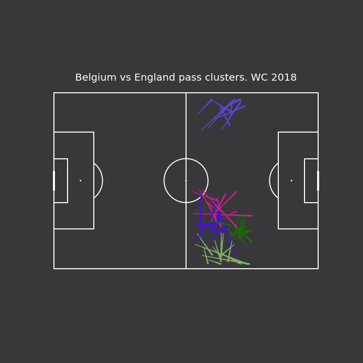
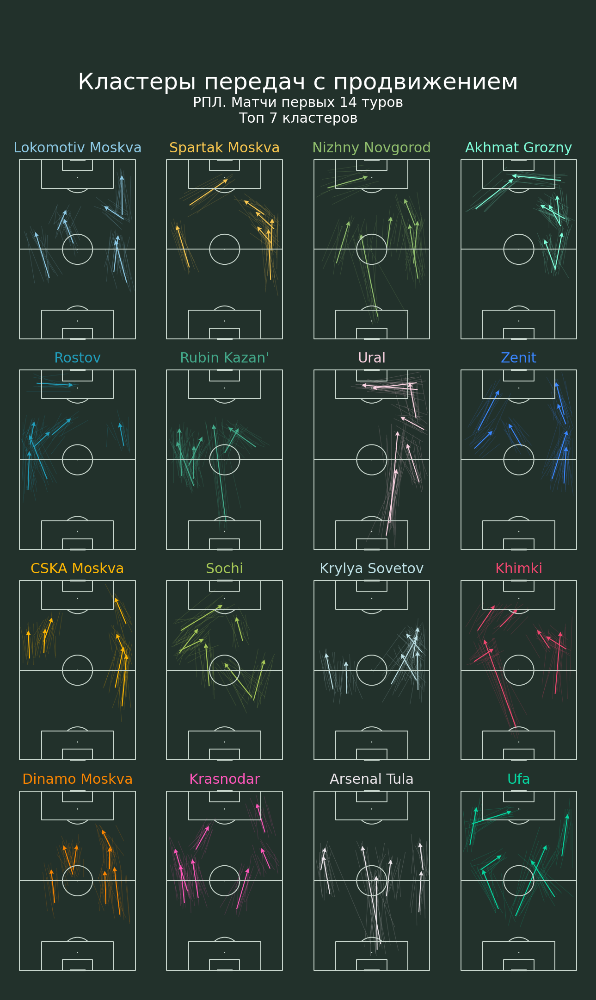
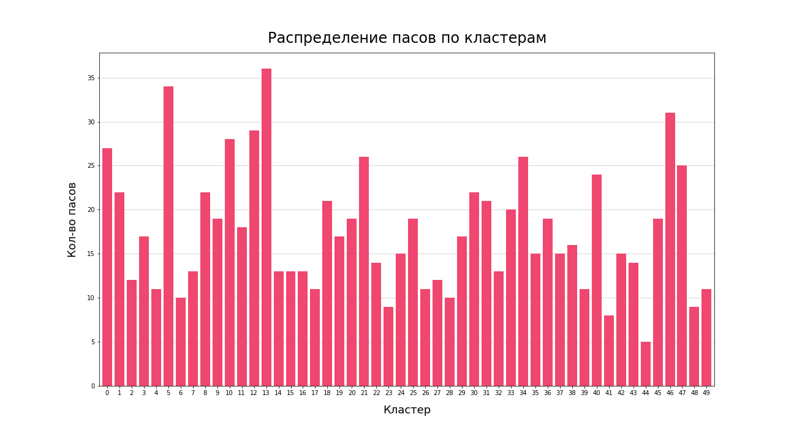

# How to do KMeans Clustering in Python

## Tutorial

A tutorial on how to plot pass clusters with KMeans clustering using data from Statsbomb

Based on the [video](https://www.youtube.com/watch?v=rXHChgdXc0M) by McKay Johns

Libraries used: pandas, numpy, mplsoccer, statsbombpy, sklearn

### Result

## RPL Teams progressive passes clusters. Part 1

Clustering progressive passes for each RPL team based on first 14 games of season 21/22. Data got from wyscout.  
Vizualize top 7 clusters for each team.

### Result

## RPL Teams progressive passes clusters. Part 2

Clustering progressive passes for ONE TEAM into 50 clusters and show their (passes) distribution between clusters. 
Based on first 14 games of season 21/22. Data got from wyscout.  

### Result

