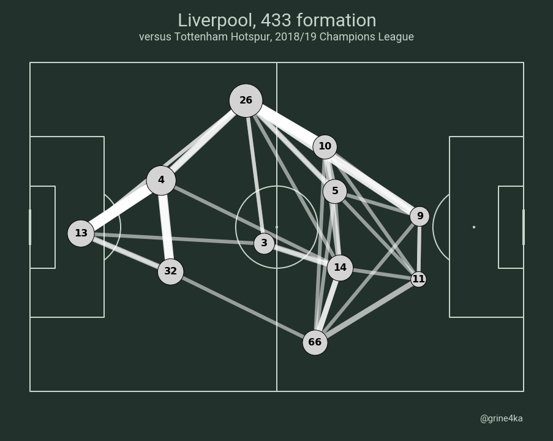

# How to Create Football Pass Networks in Python

A tutorial on how to plot pass networks using data from Statsbomb API

Jupyter Notebook made from [video](https://www.youtube.com/watch?v=fPcY9dbOMGM) by McKay Johns

Libraries used: pandas, mplsoccer, statsbomb api

## Result

