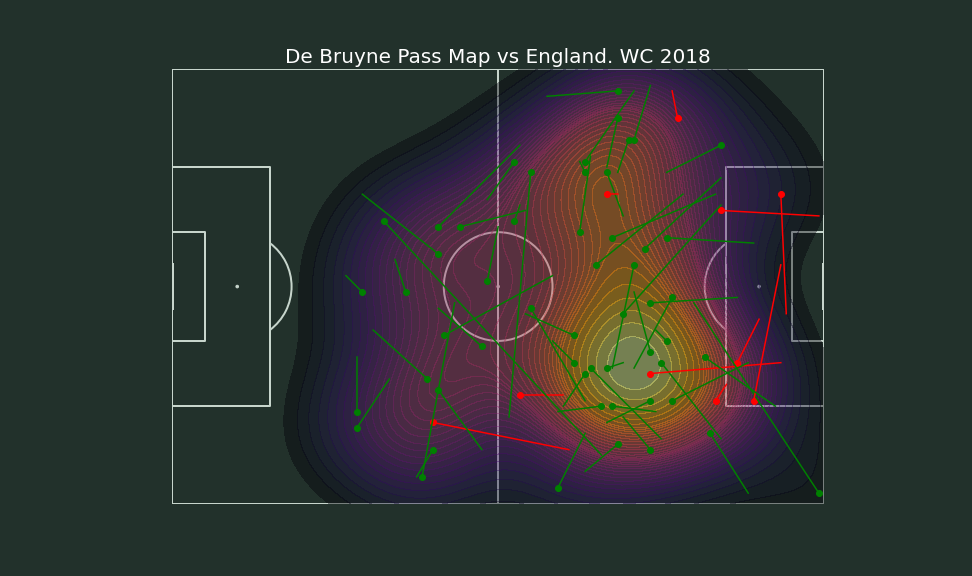

# Creating Pass and Heat Maps using Python

A tutorial on how to make pass map and heat map using matplotlib using data Statsbomb API

Jupyter Notebook made from [videos](https://www.youtube.com/playlist?list=PL10a1_q15HwqVEcnqt3tXs1bgvawjsQNW) by McKay Johns

Libraries used: pandas, mplsoccer, statsbomb api, seaborn

## Result

