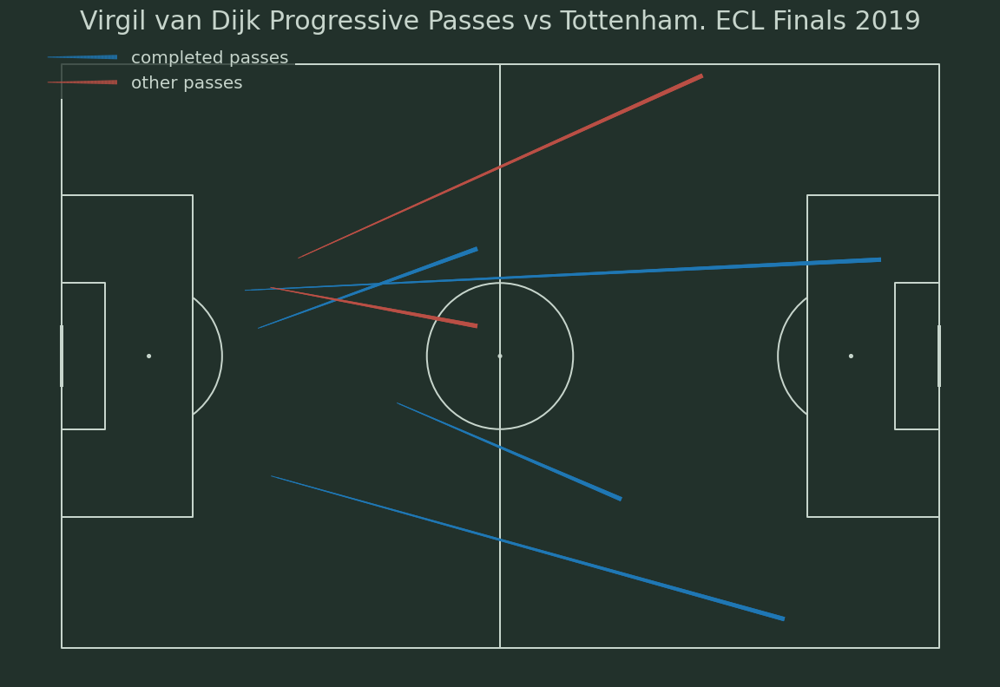

# How to Calculate Progressive Passes in Python

A tutorial on how to calculate and plot progressive passes

Jupyter Notebook made from [video](https://www.youtube.com/watch?v=kuD1yMwjCwE) by McKay Johns

### Data
Liverpool vs Tottenham ECL Finals 2019 from StatsBomb open-data 

### Libraries
pandas, numpy, matplotlib, mplsoccer, statsbombpy

## Result

