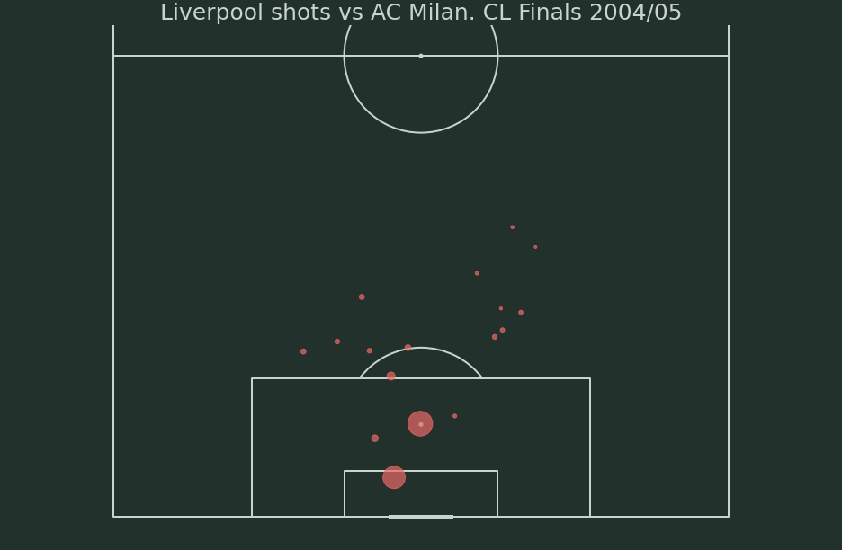

# Creating Shot Map using Python

A tutorial on how to make shot map using Python and data from Statsbomb API

Jupyter Notebook made from [videos](https://www.youtube.com/playlist?list=PL10a1_q15HwqVEcnqt3tXs1bgvawjsQNW) by McKay Johns

Libraries used: pandas, mplsoccer, statsbomb api

## Result

