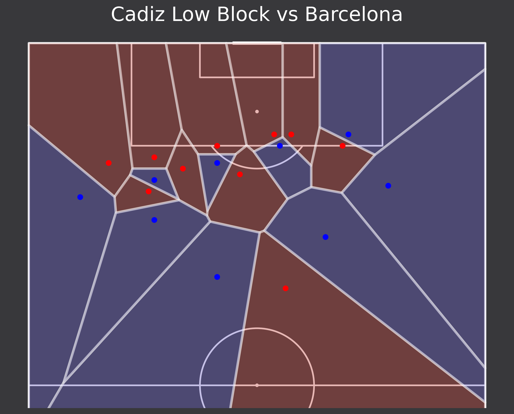
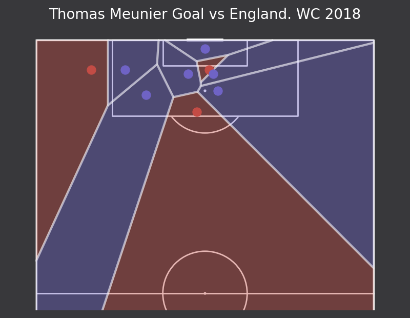

# How to Plot Voronoi Diagrams in Python

A tutorial on how to plot Voronoi diagram using frame data from Statsbomb open data

First part of this notebook is made from McKay Johns' [video](https://www.youtube.com/playlist?list=PL10a1_q15HwqVEcnqt3tXs1bgvawjsQNW).  
And the second part - from mplsoccer [example](https://mplsoccer.readthedocs.io/en/latest/gallery/pitch_plots/plot_voronoi.html)

Libraries used: pandas, numpy, mplsoccer, mplsoccer.statsbomb

## Result

### Part 1. Cadiz vs Barcelona. Feb 21, 2021

### Part 2. Belgium vs England in World Cup 2018 Bronze Medal Match

Video of this goal you can watch [here](https://youtu.be/x_5SJPKMHAA?t=7)