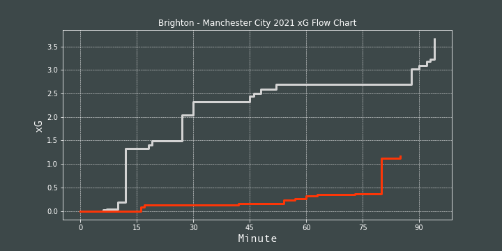

# How To Create xG Flow Charts in Python

A tutorial on how to plot xG flow chart using scraped data from Understat

Jupyter Notebook made from [video](https://www.youtube.com/watch?v=bvoOOYMQkac) by McKay Johns

Libraries used: pandas, matplotlib, requests, beautiful soup

## Result

